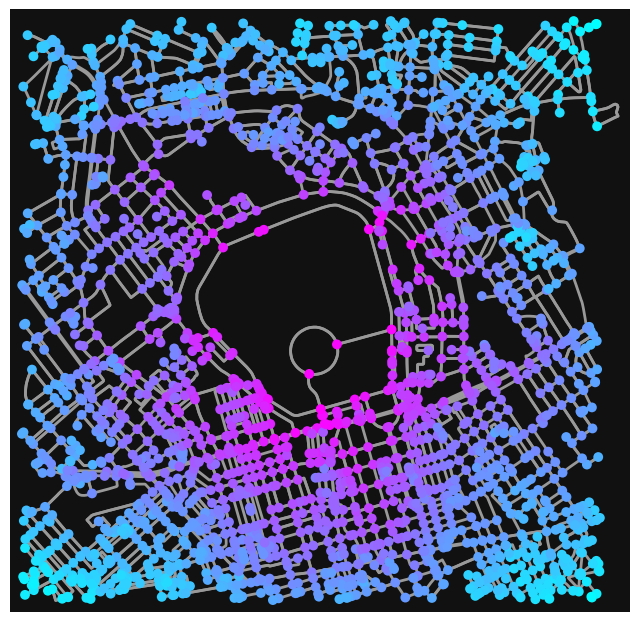
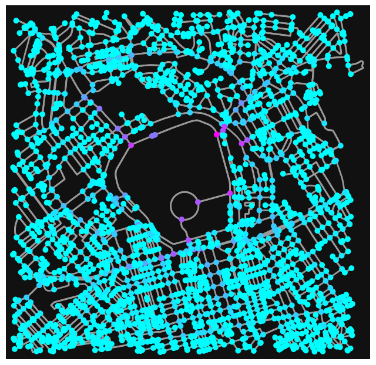
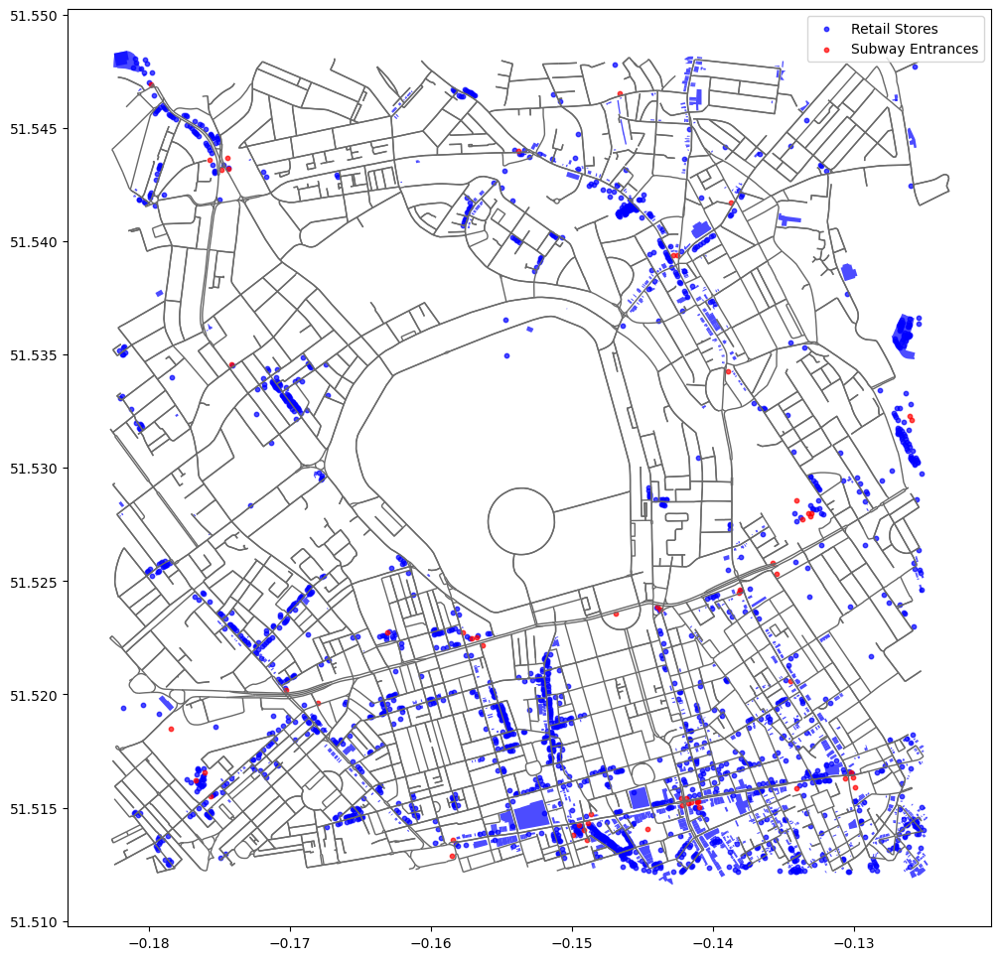
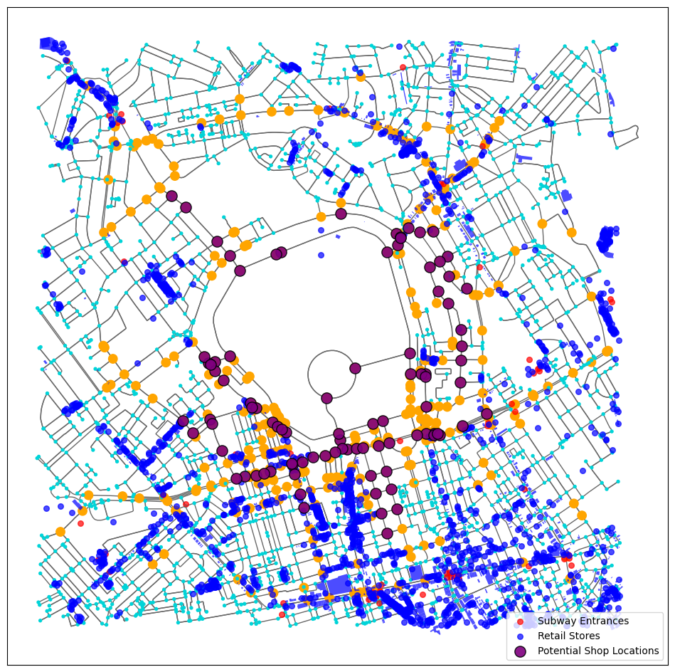

## GEOG0051 Mining Social and Geographic Datasets

## Formative Assessment


### Street Smart: Unveiling Retail Opportunities in Regent's Park

### 1 Introduction

Regardless of how good its products, merchandise, or customer service are, every retail company has to deal with three critical factors for success: location, location, location. Thus, location analysis is a common and important task in business management (Zentes, Morschett, and Schramm-Klein, 2017). In this study, we have employed the analytical power of the OSMnx library to parse through the intricacies of the street network around Regent's Park, identifying critical nodes with significant closeness and betweenness centrality (Lin, Chen and Liang, 2018). This has allowed us to pinpoint potential retail hotspots that synergize high accessibility with existing commercial facilities and public transit—a critical interplay for retail success. However, any proposed development must navigate the unique constraints and heritage considerations of the park's urban landscape, ensuring that commercial viability aligns with the area's character and regulatory framework.


```python
# imports the various library for the lab
import numpy as np
import pandas as pd
import matplotlib
import matplotlib.pyplot as plt
import geopandas as gpd
import osmnx as ox # this line imports osmnx
import networkx as nx # this line imports networkx
import warnings
warnings.filterwarnings("ignore", category=UserWarning)
```

### 2 Data and Methodology

In this study, we employed the OSMnx library to acquire and analyze the driving network within a 2000m radius around Regent's Park, London (Boeing, 2017). By calculating the street network's Closeness and Betweenness centrality, we identify key transport nodes critical to understanding the connectivity of retail locations in the area. Further, we integrated location data for retail shops and metro stations, and by overlaying this information on top of the street network analysis, we could visualize the spatial relationship between retail shops and key transport hubs. Combining these analyses, we identified optimal retail shop locations that are high centrality and close to existing commercial facilities and public transport. This approach systematically identifies new shop sites with high traffic potential and excellent locations, providing valuable insights for urban planning and business development (Han et al., 2019).


```python
# Defining the location of Regent's Park
location = "Regent's Park, London, UK"

# Access to a driving network with a radius of 2,000 metres
G = ox.graph_from_point(ox.geocode(location), dist=2000, network_type='drive')
```


```python
# GeoDataFrames that transformmed from nodes and edges of graphs
nodes, edges = ox.graph_to_gdfs(G)

# Display the first few rows of data for nodes
nodes.head()
```


<div>
<style scoped>
    .dataframe tbody tr th:only-of-type {
        vertical-align: middle;
    }

    .dataframe tbody tr th {
        vertical-align: top;
    }

    .dataframe thead th {
        text-align: right;
    }
</style>
<table border="1" class="dataframe">
  <thead>
    <tr style="text-align: right;">
      <th></th>
      <th>y</th>
      <th>x</th>
      <th>street_count</th>
      <th>highway</th>
      <th>geometry</th>
    </tr>
    <tr>
      <th>osmid</th>
      <th></th>
      <th></th>
      <th></th>
      <th></th>
      <th></th>
    </tr>
  </thead>
  <tbody>
    <tr>
      <th>78112</th>
      <td>51.526976</td>
      <td>-0.145792</td>
      <td>3</td>
      <td>NaN</td>
      <td>POINT (-0.14579 51.52698)</td>
    </tr>
    <tr>
      <th>99936</th>
      <td>51.523611</td>
      <td>-0.152791</td>
      <td>3</td>
      <td>NaN</td>
      <td>POINT (-0.15279 51.52361)</td>
    </tr>
    <tr>
      <th>99937</th>
      <td>51.523018</td>
      <td>-0.152024</td>
      <td>3</td>
      <td>NaN</td>
      <td>POINT (-0.15202 51.52302)</td>
    </tr>
    <tr>
      <th>101818</th>
      <td>51.535182</td>
      <td>-0.148105</td>
      <td>3</td>
      <td>NaN</td>
      <td>POINT (-0.14810 51.53518)</td>
    </tr>
    <tr>
      <th>101831</th>
      <td>51.535612</td>
      <td>-0.147044</td>
      <td>3</td>
      <td>NaN</td>
      <td>POINT (-0.14704 51.53561)</td>
    </tr>
  </tbody>
</table>
</div>


```python
# Display the first few rows of data for edges
edges.head()
```


<div>
<style scoped>
    .dataframe tbody tr th:only-of-type {
        vertical-align: middle;
    }

    .dataframe tbody tr th {
        vertical-align: top;
    }

    .dataframe thead th {
        text-align: right;
    }
</style>
<table border="1" class="dataframe">
  <thead>
    <tr style="text-align: right;">
      <th></th>
      <th></th>
      <th></th>
      <th>osmid</th>
      <th>name</th>
      <th>highway</th>
      <th>maxspeed</th>
      <th>access</th>
      <th>oneway</th>
      <th>reversed</th>
      <th>length</th>
      <th>geometry</th>
      <th>lanes</th>
      <th>ref</th>
      <th>bridge</th>
      <th>junction</th>
      <th>width</th>
      <th>est_width</th>
      <th>tunnel</th>
      <th>service</th>
    </tr>
    <tr>
      <th>u</th>
      <th>v</th>
      <th>key</th>
      <th></th>
      <th></th>
      <th></th>
      <th></th>
      <th></th>
      <th></th>
      <th></th>
      <th></th>
      <th></th>
      <th></th>
      <th></th>
      <th></th>
      <th></th>
      <th></th>
      <th></th>
      <th></th>
      <th></th>
    </tr>
  </thead>
  <tbody>
    <tr>
      <th rowspan="3" valign="top">78112</th>
      <th>25508583</th>
      <th>0</th>
      <td>129375498</td>
      <td>Outer Circle</td>
      <td>unclassified</td>
      <td>20 mph</td>
      <td>permissive</td>
      <td>False</td>
      <td>False</td>
      <td>19.391</td>
      <td>LINESTRING (-0.14579 51.52698, -0.14578 51.52680)</td>
      <td>NaN</td>
      <td>NaN</td>
      <td>NaN</td>
      <td>NaN</td>
      <td>NaN</td>
      <td>NaN</td>
      <td>NaN</td>
      <td>NaN</td>
    </tr>
    <tr>
      <th rowspan="2" valign="top">25508584</th>
      <th>0</th>
      <td>129375498</td>
      <td>Outer Circle</td>
      <td>unclassified</td>
      <td>20 mph</td>
      <td>permissive</td>
      <td>False</td>
      <td>True</td>
      <td>63.845</td>
      <td>LINESTRING (-0.14579 51.52698, -0.14581 51.52755)</td>
      <td>NaN</td>
      <td>NaN</td>
      <td>NaN</td>
      <td>NaN</td>
      <td>NaN</td>
      <td>NaN</td>
      <td>NaN</td>
      <td>NaN</td>
    </tr>
    <tr>
      <th>1</th>
      <td>4257258</td>
      <td>Cambridge Terrace</td>
      <td>residential</td>
      <td>20 mph</td>
      <td>permissive</td>
      <td>True</td>
      <td>False</td>
      <td>102.544</td>
      <td>LINESTRING (-0.14579 51.52698, -0.14551 51.526...</td>
      <td>NaN</td>
      <td>NaN</td>
      <td>NaN</td>
      <td>NaN</td>
      <td>NaN</td>
      <td>NaN</td>
      <td>NaN</td>
      <td>NaN</td>
    </tr>
    <tr>
      <th rowspan="2" valign="top">99936</th>
      <th>2146383887</th>
      <th>0</th>
      <td>204647020</td>
      <td>York Gate</td>
      <td>unclassified</td>
      <td>20 mph</td>
      <td>permissive</td>
      <td>False</td>
      <td>False</td>
      <td>8.052</td>
      <td>LINESTRING (-0.15279 51.52361, -0.15268 51.52363)</td>
      <td>NaN</td>
      <td>NaN</td>
      <td>NaN</td>
      <td>NaN</td>
      <td>NaN</td>
      <td>NaN</td>
      <td>NaN</td>
      <td>NaN</td>
    </tr>
    <tr>
      <th>4544836433</th>
      <th>0</th>
      <td>233623258</td>
      <td>York Gate</td>
      <td>unclassified</td>
      <td>20 mph</td>
      <td>permissive</td>
      <td>True</td>
      <td>False</td>
      <td>46.768</td>
      <td>LINESTRING (-0.15279 51.52361, -0.15294 51.523...</td>
      <td>NaN</td>
      <td>NaN</td>
      <td>NaN</td>
      <td>NaN</td>
      <td>NaN</td>
      <td>NaN</td>
      <td>NaN</td>
      <td>NaN</td>
    </tr>
  </tbody>
</table>
</div>


```python
# Calculating Centrality Metrics with NetworkX
G_simple = nx.Graph(G)  # Convert to simple diagram
closeness = nx.closeness_centrality(G_simple)
betweenness = nx.betweenness_centrality(G_simple)

# Add centrality indicators to node attributes
for node in G_simple.nodes:
    G_simple.nodes[node]['closeness_c'] = closeness[node]
    G_simple.nodes[node]['betweenness_c'] = betweenness[node]
```


```python
# Visualising Closeness Centrality
node_closeness_centrality = ox.plot.get_node_colors_by_attr(G_simple, 'closeness_c', cmap='cool')
fig, ax = ox.plot_graph(G, node_color=node_closeness_centrality, node_size=50, edge_linewidth=2, edge_color='#999')
plt.show()

# Visualising Betweenness Centrality
node_betweenness_centrality = ox.plot.get_node_colors_by_attr(G_simple, 'betweenness_c', cmap='cool')
fig, ax = ox.plot_graph(G, node_color=node_betweenness_centrality, node_size=50, edge_linewidth=2, edge_color='#999')
plt.show()
```


    

    


    

    


```python
# Get geographic coordinates of Regent's Park
location_point = ox.geocode(location)

# Get retails around Regent's Park
retail_stores = ox.features_from_point(center_point=location_point, tags={'shop': True}, dist=2000)

# Get the tube stations around Regent's Park
subway_entrances = ox.features_from_point(center_point=location_point, tags={'railway': 'subway_entrance'}, dist=2000)

# Converting Networks to GeoDataFrames
nodes, edges = ox.graph_to_gdfs(G)

fig, ax = plt.subplots(figsize=(12, 12))

# Mapping the street network
edges.plot(ax=ax, linewidth=1, edgecolor="dimgray")

# Mapping retail shops
retail_stores.plot(ax=ax, color='blue', alpha=0.7, markersize=10, label='Retail Stores')

# Mapping metro stations
subway_entrances.plot(ax=ax, color='red', alpha=0.7, markersize=10, label='Subway Entrances')

ax.legend()
plt.show()
```

    C:\Users\Louis\AppData\Local\Temp\ipykernel_324\1651015522.py:24: UserWarning: Legend does not support handles for PatchCollection instances.
    See: https://matplotlib.org/stable/tutorials/intermediate/legend_guide.html#implementing-a-custom-legend-handler
      ax.legend()
    


    

    


### 3 Results

Our analysis reveals strategic locations for potential retail development in the vicinity of Regent's Park. By integrating street network centrality with the locations of existing retail stores and subway entrances, we identified nodes with high closeness and betweenness centrality as prime candidates for commercial venues (Porta et al., 2009). The juxtaposition of these nodes with transportation hubs and commercial entities provides a clear indication of areas that offer high accessibility and foot traffic potential—critical attributes for successful retail sites. The proposed locations, highlighted in purple on the map, reflect a synthesis of urban connectivity and commercial viability.


```python
# Threshold for obtaining nodes with higher centrality
closeness_threshold = np.percentile(list(closeness.values()), 90)
betweenness_threshold = np.percentile(list(betweenness.values()), 90)

# Filter out those nodes with high Closeness centrality and high betweeness centrality
high_closeness_nodes = [node for node, c in closeness.items() if c >= closeness_threshold]
high_betweenness_nodes = [node for node, b in betweenness.items() if b >= betweenness_threshold]

# Get the position information of the node
node_positions = {node: (data['x'], data['y']) for node, data in G_simple.nodes(data=True)}

# Create graphics of street networks, higher centrality nodes, retail shops and metro stations
fig, ax = plt.subplots(figsize=(12, 12))
edges.plot(ax=ax, linewidth=1, edgecolor="dimgray")

# Drawing nodes with high centrality
nc = ['orange' if node in high_closeness_nodes or node in high_betweenness_nodes else '#00D4D8' for node in G_simple.nodes()]
ns = [80 if node in high_closeness_nodes or node in high_betweenness_nodes else 8 for node in G_simple.nodes()]
nx.draw_networkx_nodes(G_simple, pos=node_positions, node_color=nc, node_size=ns, ax=ax)

# Add metro station and retail shop locations
subway_entrances.plot(ax=ax, color='red', alpha=0.7, markersize=30, zorder=3, label='Subway Entrances')
retail_stores.plot(ax=ax, color='blue', alpha=0.7, markersize=30, zorder=3, label='Retail Stores')

# Marking the best possible sites
potential_locations_plotted = False  # Marks if the points of potential locations have been plotted
for node in high_closeness_nodes:
    if node in high_betweenness_nodes:
        x, y = node_positions[node]
        label = 'Potential Shop Locations' if not potential_locations_plotted else None
        ax.scatter(x, y, s=120, c='purple', edgecolors='black', alpha=0.9, zorder=4, label=label)
        potential_locations_plotted = True  # 更新标记，表明潜在位置的点已绘制

# Display the legend, place it in the bottom right corner of the image
ax.legend(loc='lower right')

# Display graphs
plt.show()
```

    C:\Users\Louis\AppData\Local\Temp\ipykernel_324\14825782.py:35: UserWarning: Legend does not support handles for PatchCollection instances.
    See: https://matplotlib.org/stable/tutorials/intermediate/legend_guide.html#implementing-a-custom-legend-handler
      ax.legend(loc='lower right')
    


    

    


## Conclusion

Our spatial analysis, though adequate for pinpointing potential retail sites near Regent's Park, must be viewed within the context of urban regulations and the park's unique character, which may restrict commercial activities in certain areas. Additionally, while our study focused on geographic and infrastructural factors, the multifaceted nature of retail success—encompassing market trends and consumer preferences—calls for a more extensive approach. Future enhancements could include real-time data on pedestrian flows and consumer behaviors alongside considerations of evolving urban policies.


## References

Boeing, G. (2017) ‘OSMnx: New methods for acquiring, constructing, analyzing, and visualizing complex street networks’, Computers, Environment and Urban Systems, 65, pp. 126–139.

Han, Z. et al. (2019) ‘Identifying Spatial Patterns of Retail Stores in Road Network Structure’, Sustainability, 11(17), p. 4539. Available at: https://doi.org/10.3390/su11174539.

Lin, G., Chen, X. and Liang, Y. (2018) ‘The location of retail stores and street centrality in Guangzhou, China’, Applied geography, 100, pp. 12–20.

Porta, S. et al. (2009) ‘Street Centrality and Densities of Retail and Services in Bologna, Italy’, Environment and Planning B: 
Planning and Design, 36(3), pp. 450–465. Available at: https://doi.org/10.1068/b34098.

Zentes, J., Morschett, D. and Schramm-Klein, H. (2017) Strategic Retail Management. Wiesbaden: Springer Fachmedien Wiesbaden. Available at: https://doi.org/10.1007/978-3-658-10183-1.
